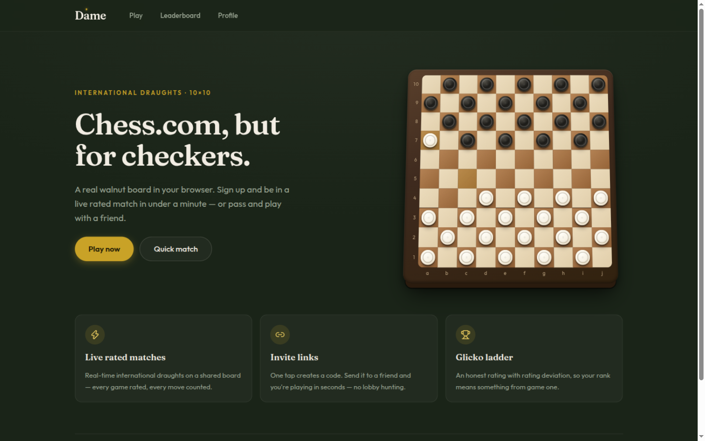
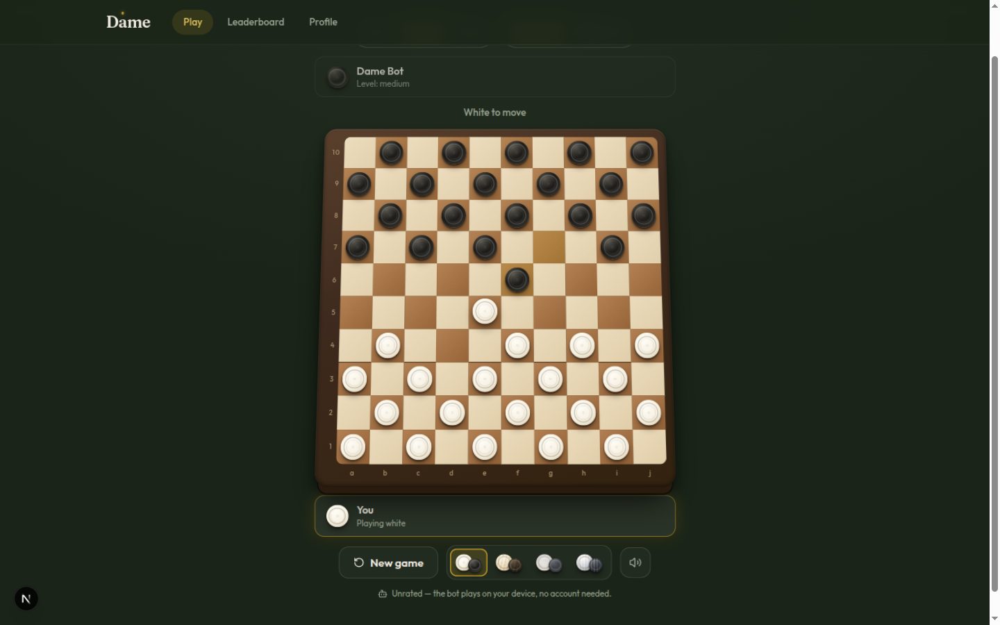

# Dame — Chess.com, but for checkers

Dame is an open platform for playing **international draughts (10×10)** online: live rated matches against friends, a built-in bot with three strength levels, a Glicko-2 ladder, game chat, and a handcrafted classic-premium board you can actually feel through the screen.

<p align="center">
  
</p>
<p align="center">
  
</p>

## Features

- **Strict FMJD international draughts** — 10×10 board, forward-only men, flying kings, mandatory majority captures, promotion ends capture chains. Implemented as a pluggable rules engine (`lib/rules/`), so other variants are new modules, not rewrites.
- **Play vs the bot** — a client-side negamax engine with alpha-beta pruning and iterative deepening (`lib/bot/`). Three levels: Easy, Medium, Hard. No account required, unrated.
- **Live rated matches** — invite a friend with a one-tap code, play in a shared realtime room (Durable Objects + WebSockets), server-validated moves, reconnection handling.
- **Glicko-2 ladder** — honest ratings with rating deviation, per-game rating history, public leaderboard.
- **Game chat & presence** — emotes, typing indicators, opponent online/offline dots.
- **Physical in-board feedback** — invalid taps shake the square, mandatory-capture pieces pulse, promotions burst with a crown, last move leaves a brass trail. A custom "faah!" sample plays on any multi-capture.
- **Customizable pieces** — four handcrafted textures (classic lacquer, walnut grain, marble, brushed metal), persisted per player.
- **Sound design** — WebAudio synth for moves/captures/wins plus a recorded call-out for double and triple jumps. Fully toggleable.

## Tech stack

| Layer      | Choice |
| ---------- | ------ |
| Web app    | Next.js (App Router) · React · TypeScript strict · Tailwind CSS 4 |
| Auth       | Clerk (middleware-protected routes, themed hosted UI) |
| Database   | Neon Postgres via Drizzle ORM (HTTP driver) |
| Realtime   | Cloudflare Worker + `GameRoom` Durable Object (WebSockets, SQLite state) |
| Ratings    | Glicko-2 (`lib/ratings/`) |
| Email      | Resend + React Email templates |
| Errors     | Sentry |
| Hosting    | Cloudflare Workers via [OpenNext](https://opennext.js.org/cloudflare) |
| Tooling    | Bun · Vitest · Playwright · ESLint · Drizzle Kit |

## Project structure

```
app/                     Next.js App Router (pages + API routes)
components/dame/         Dame UI (board, plaques, bot, chat, nav, pickers)
components/ui/           shadcn/ui primitives
lib/rules/               Pluggable draughts rules engine (FMJD international)
lib/bot/                 Bot engine (negamax + alpha-beta + iterative deepening)
lib/ratings/             Glicko-2 rating math
lib/db/                  Drizzle schema + Neon client
hooks/useGameRoom.ts     Realtime room client (WebSocket protocol)
design-system/DAME/      Design system master file (tokens, components, motion)
docs/specs/              Product + design specs
docs/screenshots/        Product screenshots
worker/                  Realtime worker: Durable Object game rooms
drizzle/                 SQL migrations
tests/                   Playwright E2E suites
emails/                  React Email templates
```

## Getting started

### Prerequisites

- [Bun](https://bun.com) 1.3+
- A [Neon](https://neon.tech) Postgres database
- A [Clerk](https://clerk.com) application (email + Google social login)
- A [Cloudflare](https://dash.cloudflare.com) account (realtime worker + hosting)
- Optional: a [Resend](https://resend.com) API key for invite emails, a Sentry project for error tracking

### 1. Install and configure

```bash
bun install
cp .env.example .env.local   # if present, otherwise create .env.local
```

Fill `.env.local` (never commit it):

| Variable | Purpose |
| -------- | ------- |
| `DATABASE_URL` | Neon Postgres connection string |
| `NEXT_PUBLIC_CLERK_PUBLISHABLE_KEY` / `CLERK_SECRET_KEY` | Clerk auth |
| `NEXT_PUBLIC_CLERK_SIGN_IN_URL` / `NEXT_PUBLIC_CLERK_SIGN_UP_URL` | Auth route paths (`/sign-in`, `/sign-up`) |
| `NEXT_PUBLIC_ROOM_WS_URL` | Realtime worker WebSocket base URL |
| `GAME_TOKEN_SECRET` | HMAC secret minting room role tokens (`openssl rand -hex 32`) |
| `NEXT_PUBLIC_SENTRY_DSN` | Optional error tracking |
| `RESEND_API_KEY` | Optional invite emails |

### 2. Set up the database

```bash
bunx drizzle-kit push       # applies drizzle/*.sql migrations
```

### 3. Run the app

```bash
bun dev                     # http://localhost:3000
```

To play locally **without** any Clerk/DB setup (keyless mode, protected routes open):

```bash
E2E_BYPASS_AUTH=1 bun dev
```

### 4. Run the realtime worker

```bash
cd worker
bun install
cp .dev.vars.example .dev.vars   # set GAME_TOKEN_SECRET + NEXT_PUBLIC_ROOM_WS_URL
bunx wrangler dev --local        # ws://localhost:8787
```

Then point `NEXT_PUBLIC_ROOM_WS_URL` in the web app at the worker URL. The
create-game flow is UI-free: `POST /api/room` mints role tokens,
`/play/<gameId>?role=white|black` joins the room.

## Testing

```bash
bun run typecheck           # tsc --noEmit
bun run lint                # eslint
bunx vitest run             # unit + component tests (engine, API routes, UI)
bunx playwright test        # E2E — needs a dev server; see tests/*.spec.ts headers
```

The rules engine is test-locked: forward-only men's moves, bidirectional
captures, majority-capture rule, flying kings, and promotion semantics all
have regression suites under `lib/rules/`.

## Deployment

The web app targets **Cloudflare Workers** via OpenNext:

```bash
bunx opennextjs-cloudflare build
bunx opennextjs-cloudflare deploy
```

`wrangler.jsonc` carries the R2 incremental cache, image binding, and the
server-side Clerk route vars. Secrets (database URL, Clerk secret key, game
token secret, Resend key) live in `wrangler secret put` — never in git.

The realtime worker deploys separately:

```bash
cd worker
bunx wrangler deploy        # uses worker/wrangler.toml (Durable Object migration included)
wrangler secret put GAME_TOKEN_SECRET
```

Smoke checks after deploying: `/api/status` (database + realtime worker
health), `/status` dashboard, and one invite → join → move → finish →
leaderboard round-trip.

## Contributing

Contributions are welcome. A few ground rules to keep reviews fast:

- `bun run typecheck && bun run lint && bunx vitest run` must pass before every commit.
- Rules-engine changes need regression tests in `lib/rules/` — the existing
  suites are the contract.
- UI work follows `design-system/DAME/MASTER.md`: no raw hex in components
  (tokens live in `app/dame-tokens.css`), no toasts during gameplay (feedback
  is physical and on the board), board testids are a stable contract.
- Keep PRs scoped to one stage of `docs/specs/` where practical.

## License

All rights reserved until a license is decided. Reach out before reusing the
code in production.
